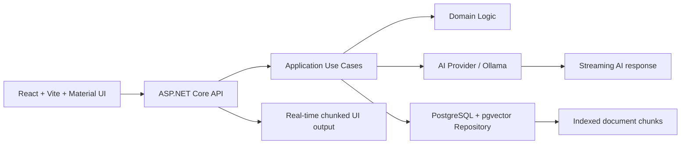

# Inova Tech Enterprise RAG Chatbot

Author: Emmanuel F.

A production-ready, enterprise-focused RAG (Retrieval-Augmented Generation) chatbot built with .NET 9, Clean Architecture, PostgreSQL with pgvector, and Ollama for local AI inference. The solution is designed to provide secure, low-latency, document-grounded conversations for business environments where reliability and governance matter.

## Overview

This project demonstrates how to build a scalable AI assistant that answers questions using internal enterprise documents rather than relying on general-purpose knowledge alone. The system indexes uploaded files, creates vector embeddings, retrieves the most relevant document chunks, and streams the answer back to the user in real time.

The design follows Clean Architecture principles so that application logic, business rules, persistence, and AI integration remain decoupled and testable.

## Why this architecture

The platform was designed for enterprise scenarios where:

- security boundaries are essential,
- document privacy matters,
- response time must remain low,
- the system must remain maintainable and scalable,
- AI features must be testable in isolation.

By combining modern streaming patterns with domain-driven design, the solution delivers a smooth user experience while keeping critical business logic separated from infrastructure concerns.

## Architecture



### Main layers

- Presentation: REST API and web-layer orchestration
- Application: Use cases and business workflows
- Domain: Entities, domain rules, and repository contracts
- Infrastructure: PostgreSQL persistence, vector search, AI provider adapters
- Shared: common result models and cross-cutting abstractions

## Tech stack

- .NET 9+
- ASP.NET Core
- Clean Architecture
- PostgreSQL + pgvector
- Ollama
- React + Vite + Material UI
- IAsyncEnumerable-based streaming
- xUnit + Moq for tests

## Key capabilities

- document upload and chunking
- semantic search using embeddings
- retrieval of relevant context from stored documents
- AI answer generation grounded only in the retrieved text
- step-by-step streaming responses to the UI
- clean separation between domain, infrastructure, and web concerns
- enterprise-friendly maintainability and testability

## Streaming experience

The chatbot uses asynchronous streaming to send content chunk by chunk to the frontend. This allows the UI to render a natural typewriter effect similar to modern AI assistants, without blocking the user while waiting for the whole answer.

This is implemented using `IAsyncEnumerable<string>` so the application can yield response fragments progressively from the AI layer down to the API and finally to the browser.

## Project structure

```text
RagSystem/
├── src/
│   ├── RagSystem.Application/
│   ├── RagSystem.Domain/
│   ├── RagSystem.Infrastructure/
│   ├── RagSystem.Presentation/
│   └── RagSystem.Shared/
├── tests/
│   └── RagSystem.Tests/
├── docker-compose.yml
├── Dockerfile
├── RagSystem.sln
└── README.md
```

## Getting started

### Prerequisites

- .NET 9 SDK
- Docker and Docker Compose
- PostgreSQL with pgvector support
- Ollama installed and configured locally

### Restore and build

```bash
dotnet restore
dotnet build
```

### Run the stack with Docker

```bash
docker-compose up --build
```

### Run tests

```bash
dotnet test tests/RagSystem.Tests/RagSystem.Tests.csproj
```

You can also run a focused test set:

```bash
dotnet test tests/RagSystem.Tests/RagSystem.Tests.csproj --filter UploadDocumentsUseCaseTest
```

## Example use case

A user asks a question about internal policies, product information, or internal documentation. The application:

1. receives the question,
2. creates an embedding for the query,
3. searches the vector store for relevant document chunks,
4. injects the context into a strict system prompt,
5. asks the AI model to answer only from that context,
6. streams the response back to the user.

This design reduces hallucination risk and keeps answers anchored to approved enterprise knowledge.

## Design principles

- Clean Architecture for maintainability
- explicit contracts between layers
- domain-driven business logic
- test-first validation of core behaviors
- streaming-first UX patterns
- secure local AI inference when needed

## Notes

This project is a fictional enterprise example inspired by modern AI product patterns. It is designed to showcase how to combine enterprise architecture, semantic retrieval, and real-time AI interfaces in a structured and scalable way.

## License

This project is intended for learning and demonstration purposes.
